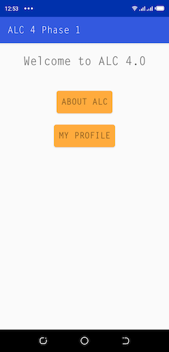
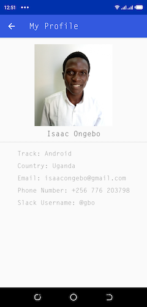

# alc-challenge-phase-one
This app is my solution to Android [challenge 1](https://docs.google.com/document/d/1GsTwCCmG9krpzt0LsSpk6rHzGFfmTxrqLhDWO6veQ2A/preview#) of the Andela Learning Community ([ALC](https://andela.com/alc/)) 4.0 program. It displays the ALC homepage and my profile info.
## Building
Follow these steps to run the app:
* Clone this repo (`git clone https://github.com/ongebo/alc-challenge-phase-one`)
* Open the clone in Android Studio and wait for the Gradle `sync` task to complete
* Run the app on an emulator or real device
## Screenshots
#### Home Page

#### About ALC Screen

#### My Profile Page**

